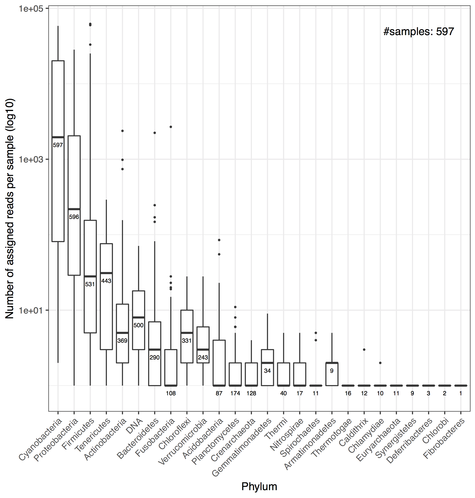
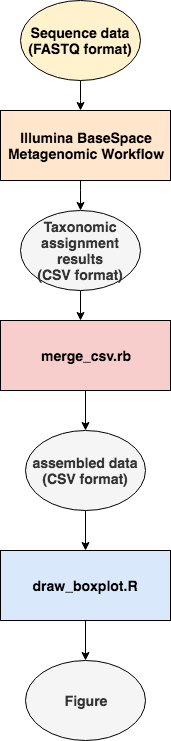

# メタ16Sシーケンスの各サンプルから得られたリードの数の分布を生物分類ごとに可視化する

## 著者
大田達郎

## 著者の所属
ライフサイエンス統合データベースセンター

## 論文のDOI
https://doi.org/10.1007/s10265-018-1017-x

## 論文中での図の番号
Figure 3

## 論文中における図のタイトル
Pyhlum-level taxonomic abundance ratios estimated by the initial taxonomic assignment of the 597 samples

## 図

## 論文の概要
本研究では、沖縄を除く日本全国に分布するソメイヨシノの花弁表面に付着した環境DNAの収集と分析を目的とした。花弁表面をバッファに浸した綿棒で拭い、ボイル法によってDNAを抽出後、16S rRNA V4領域を増幅し、Illumina MiSeq にてペアエンド アンプリコンシーケンスを行った。得られたシーケンスデータを元に環境DNAの由来を調べたところ、スギを始めとした様々な植物に由来すると思われるDNAがソメイヨシノの花びら表面に付着していたことが明らかになった。

## 論文における図の位置付け
得られたリードを入力に Illumina BaseSpace System Metagenomics Workflow (ver. 1.0.0.79) を用いて taxonomic assignment を行い、リードが由来する生物を門によって分類した。環境DNAには微生物が多く含まれると想定していたが、シーケンスによって得られたリードの由来のほとんどが Cyanobacteria, Proteobacteria であることを示している。

## ワークフロー (図)

## 計算機環境
MacBookAir (Early 2015), 2.2GHz デュアルコア Intel Core i7, 8GB Memory, 512GB フラッシュストレージ https://support.apple.com/kb/SP714

## OSのバージョン
macOS Sierra (10.12.6)

## 使用するプログラミング言語・ライブラリ・ツールとそのバージョン

- Ruby 2.6.0
- R version 3.5.2 (2018-12-20), bioconductor/release_base2:R3.4.3_Bioc3.6
  - ggplot2 3.1.0

## データ入手先・サイズ
- URL: https://github.com/inutano/ohanami-project-manuscript/tree/master/figure3/data
- Files:
  - 26429776.csv: 7.0K
  - 26429778.csv: 3.1K
  - 26429780.csv: 6.5K
  - 26478496.csv: 3.4K
  - 26713858.csv: 10K
  - 26714853.csv: 7.6K

## GitHub の URL
https://github.com/inutano/ohanami-project-manuscript/tree/master/figure3

## その他
コンテナを利用する場合は以下の利用を推奨します。

- ruby:2.6.0-slim (Ruby)
- bioconductor/release_base2:R3.5.2_Bioc3.8 (R)
